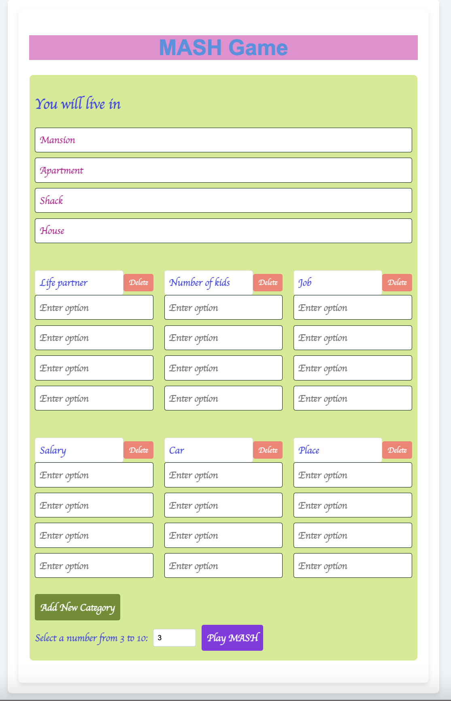
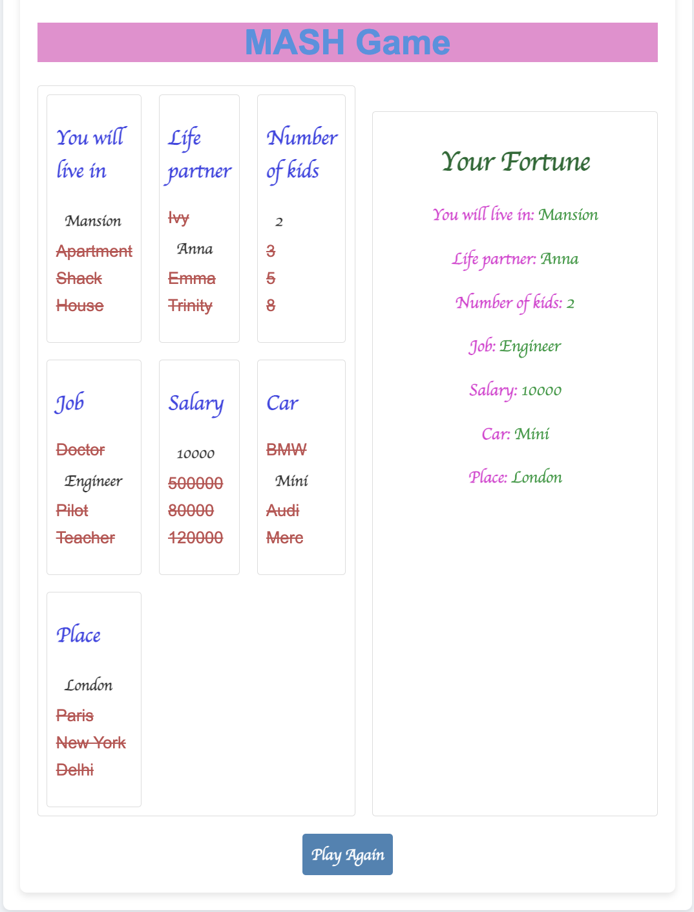

# mash-game-vue3-ts

## Project setup

```sh {"id":"01J0GZJREKAX5NP2MP6D5DBHR6"}
yarn install
```

### Compiles and hot-reloads for development

```sh {"id":"01J0GZJREMFACXVH4A63HVPK3Y"}
yarn serve
```

### Compiles and minifies for production

```sh {"id":"01J0GZJREMFACXVH4A64DAN7V3"}
yarn build
```

### Lints and fixes files

```text {"id":"01J0GZJREMFACXVH4A66ZDDRAE"}
yarn lint
```

### User Guide

1. After 'yarn serve' open the URL in any web browser:
   http://localhost:8080/
2. You will the screen:
   
3. Select your number and hit the RunMASH button
   
4. You will see the Result:
   
